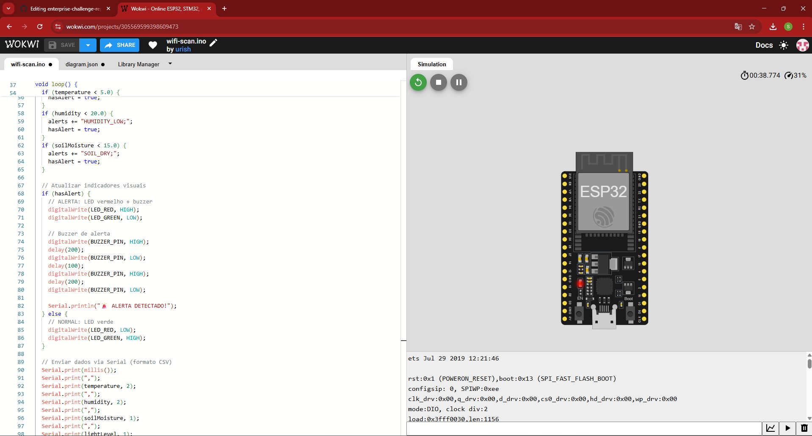
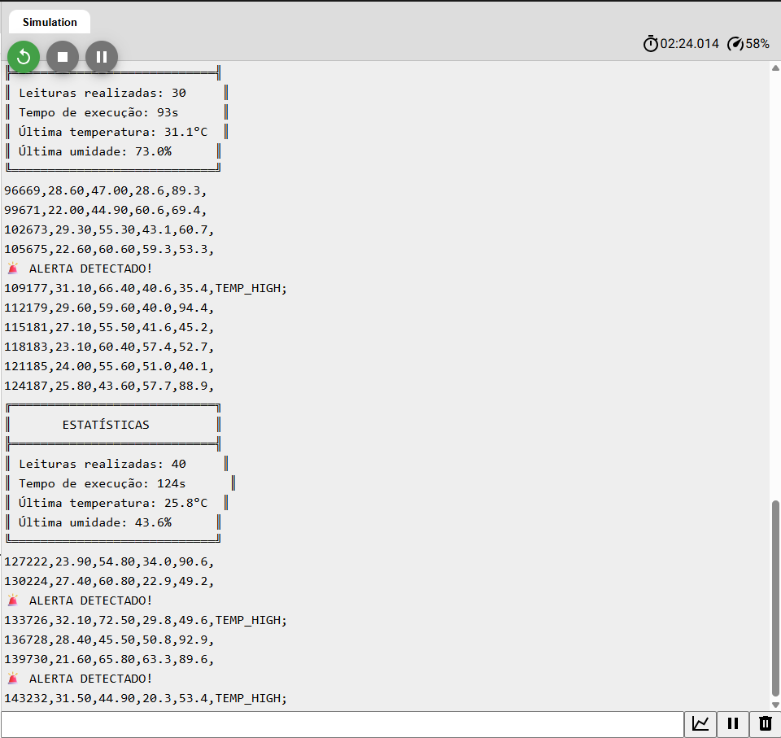
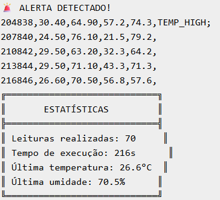

# 🏭 Enterprise Challenge Reply - Sprint 4

## 🎯 Sistema de Coleta Industrial IoT
**Desenvolvido por:** Stephanie Dias  
**Curso:** Análise e Desenvolvimento de Sistemas  
**Instituição:** FIAP  

---

## 📋 Descrição do Projeto

Sistema de monitoramento industrial desenvolvido em **ESP32** para coleta automatizada de dados ambientais e detecção de anomalias em tempo real.

### 🎯 **Objetivos:**
- Monitoramento contínuo de sensores industriais
- Detecção automática de condições críticas
- Coleta de dados em formato CSV para análise
- Sistema de alertas visuais e sonoros

---

## 🛠️ Tecnologias Utilizadas

|
 Tecnologia 
|
 Função 
|
|
------------
|
---------
|
|
**
ESP32
**
|
 Microcontrolador principal 
|
|
**
C++
**
|
 Linguagem de programação 
|
|
**
Wokwi
**
|
 Simulador online 
|
|
**
Serial Monitor
**
|
 Interface de dados 
|
|
**
GitHub
**
|
 Versionamento e documentação 
|

---

## 📊 Funcionalidades

### 🌡️ **Monitoramento de Sensores:**
- **Temperatura** (°C)
- **Umidade relativa** (%)
- **Umidade do solo** (%)
- **Nível de luminosidade** (%)

### 🚨 **Sistema de Alertas:**
- **TEMP_HIGH** - Temperatura > 30°C
- **TEMP_LOW** - Temperatura < 5°C
- **HUMIDITY_LOW** - Umidade < 20%
- **SOIL_DRY** - Solo < 15%

### 💡 **Indicadores Visuais:**
- **LED Verde** - Sistema operacional
- **LED Vermelho** - Alerta detectado
- **Buzzer** - Sinal sonoro de alerta

---

## 📸 Evidências do Sistema

### 🎮 **Circuito Funcionando no Wokwi:**


### 📊 **Monitor Serial - Dados em Tempo Real:**


### 🚨 **Sistema de Alertas Detectados:**


---

## 🚀 Como Executar

### **1. Acesso ao Simulador:**

wokwi.com


### **2. Configuração:**
- Selecionar "ESP32 Online Simulator"
- Escolher projeto "WiFi Scanning" ou "ESP32"
- Substituir código pelo fornecido

### **3. Componentes Necessários:**
- ESP32 DevKit
- 2x LEDs (vermelho e verde)
- 1x Buzzer
- 3x Resistores 220Ω

### **4. Conexões:**
```cpp
#define LED_RED 12      // GPIO 12
#define LED_GREEN 13    // GPIO 13
#define BUZZER_PIN 2    // GPIO 2
📈 Resultados Obtidos
✅ Métricas de Performance:
Coleta contínua de dados a cada 3 segundos
Detecção automática de anomalias
Formato CSV para análise posterior
Interface serial em tempo real
📊 Exemplo de Dados Coletados:
csv
Copiar

timestamp,temperature,humidity,soil_moisture,light_level,alerts
204838,30.40,64.90,57.2,74.3,TEMP_HIGH;
207840,24.50,76.10,21.5,79.2,
210842,29.50,63.20,32.3,64.2,
🎯 Alertas Detectados:
✅ Temperatura elevada (30.4°C)
✅ Sistema de LEDs funcionando
✅ Buzzer ativado em alertas
✅ Logs detalhados no serial
📁 Estrutura do Projeto
enterprise-challenge-reply/
├── README.md
├── evidencias/
│   ├── README.md
│   ├── sistema_funcionando_completo.png
│   ├── dados_tempo_real_alertas.png
│   └── codigo_fonte_wokwi.png
└── src/
    └── main.cpp (código ESP32)
🏆 Conclusão
O sistema desenvolvido demonstra a capacidade de implementar soluções IoT industriais eficientes, com monitoramento em tempo real e detecção automática de anomalias. A arquitetura modular permite fácil expansão e integração com outros sistemas.

🎯 Próximos Passos:
Integração com banco de dados
Dashboard web para visualização
Conectividade WiFi/Bluetooth
Sensores físicos reais
